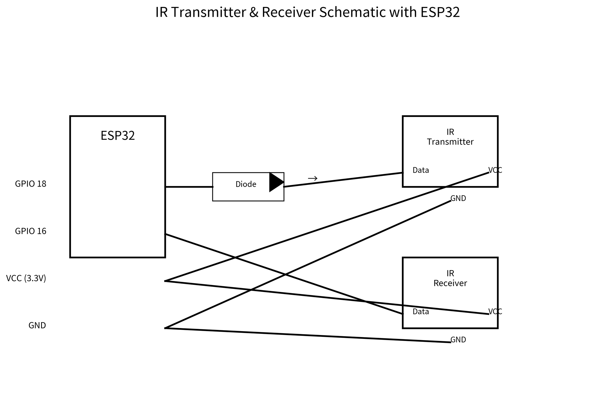

# ESP32-E IR Transmitter \& Receiver Project

This project implements an Infrared (IR) transmitter and receiver setup using an ESP32-E development board. It allows for capturing incoming IR signals (like TV remotes) and re-transmitting them.

## Wiring Diagram

Below is the schematic layout for the connections:

## Getting Started

1. **Hardware Setup:** Wire the components according to the table above or the schematic image.
2. **Flash the Code:** Upload your transmitter or receiver sketches to the ESP32-E.
3. **Testing:** Open the Serial Monitor at `115200` baud to view received codes or debug transmissions.

